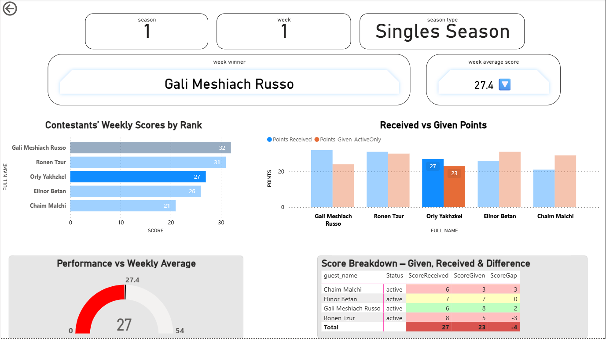

# personal-data-analysis-project
Personal data analysis project using SQL and Power BI based on the TV show “Come Dine With Me”.
The project includes data modeling, ETL processes, and analysis of contestants, episodes, and scoring patterns to identify performance trends and insights.
## Dashboard Preview

